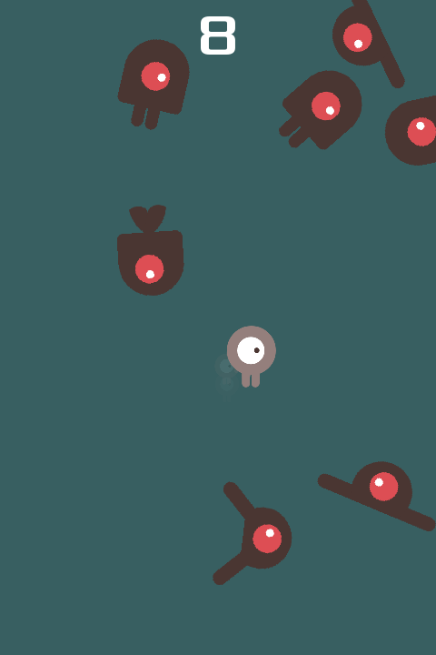

# Dodge the Creeps — Edisi HP

Turunan demo Godot ["Your first 2D game"](https://docs.godotengine.org/en/latest/getting_started/first_2d_game/index.html)
yang dikembangkan menjadi game HP: kontrol sentuh, pilihan stage, empat skin,
sistem nyawa, item yang bisa diambil, rekor per stage, jeda, dan lapisan efek
visual.

**▶ Main sekarang: <https://andrryynn21-glitch.github.io/game-2d/>**

Langsung jalan di browser HP (Android dan iPhone) maupun desktop — tidak ada
yang perlu di-install. Link itu boleh disebarkan ke siapa pun. Di HP, menu
browser *Add to Home Screen* / *Tambahkan ke layar Utama* akan memasang ikonnya
sehingga terbuka layar penuh seperti aplikasi biasa.

Unduhan pertama sekitar 40 MB (mesin Godot), jadi pembukaan pertama di jaringan
lambat butuh sebentar; sesudahnya di-cache browser dan langsung terbuka.

| | |
|---|---|
| Engine | Godot 4.7, GDScript |
| Target | Web (browser HP), portrait |
| Renderer | **GL Compatibility** (WebGL2) — sama di editor maupun hasil export |
| Kanvas | 480x720, stretch `canvas_items` + aspect `expand` |

Renderer Compatibility dipilih sadar, bukan asal: itulah yang benar-benar dipakai
saat export Web, jadi apa yang Anda lihat di editor sama dengan yang diterima
pemain. Konsekuensinya seluruh efek dibuat renderer-agnostic — `CPUParticles2D`
(bukan `GPUParticles2D`), cahaya palsu dari sprite additive (bukan glow
post-processing), dan shader yang hanya memakai aritmetika fragment sederhana.
Semuanya bebas resolusi, jadi tetap tajam di layar HP ber-DPI tinggi meski art
PNG aslinya beresolusi rendah.

## Kontrol sentuh

Dua skema, dipilih di menu utama pada bagian **Kontrol Sentuh**. Pilihannya
tersimpan dan langsung dipakai lagi di sesi berikutnya.

| Skema | Cara pakai | Kenapa ada |
|---|---|---|
| **Geser** (bawaan) | Sentuh **di mana saja**, lalu geser. Karakter mengikuti arah dan jauh geseran jari; dorongan penuh pada 110 satuan kanvas. | Jari tidak menutupi karakter. Untuk game menghindar, itu keuntungan besar — karena itu jadi bawaan. |
| **Joystick** | Stik **mengambang** beradius 84: muncul di titik jempol pertama menyentuh 60% bagian bawah layar (area atas dibiarkan untuk HUD). | Rasa arcade yang familier, tanpa stik statis yang memakan tempat di layar 480x720 yang sempit. |

Keduanya memakai dead zone 14% dan diskalakan ulang dari nol di luar ambang itu,
jadi tidak ada lompatan kecepatan saat jari baru melewatinya. Mode geser juga
menambatkan ulang titik acuannya begitu dorongan mentok — tanpa itu, jari yang
sudah jauh dari titik awal harus ditarik balik sepanjang jarak itu sebelum
karakter mau berbalik.

Keduanya digambar lewat `_draw()` (cincin + knob), jadi tidak butuh aset art dan
tajam di resolusi apa pun. Warnanya mengikuti warna aksen skin yang dipilih.

Keyboard tetap didukung sebagai bonus di desktop lewat aksi `jalan_kiri`,
`jalan_kanan`, `jalan_atas`, `jalan_bawah` (lihat *Project Settings > Input Map*).
Sentuh dan keyboard bisa hidup berdampingan: yang dorongannya lebih besar yang
dipakai, sehingga keduanya tidak saling membatalkan.

Gerakan diredam secara eksponensial dengan konstanta waktu
`Player.MOVE_SMOOTH_TIME` (0,08 detik). Ini menghilangkan hentakan kasar saat
arah berubah mendadak tanpa membuat kontrol terasa berat. Kalau Anda lebih suka
rasa snap-instan seperti versi aslinya, perkecil konstanta itu.

## Jeda

- Tombol **II** di kanan atas, ukuran sentuh besar.
- **Escape** atau **P** di desktop (aksi `jeda`).
- **Auto-pause saat fokus hilang.** Ganti tab di browser HP, telepon masuk, atau
  layar terkunci tidak lagi berarti mati sia-sia.

Saat dijeda, musik ikut berhenti dan kontrol sentuh dimatikan — jari yang masih
menempel di layar tidak akan menggerakkan karakter begitu permainan dilanjutkan.
Timer umur mob juga ikut terjeda, jadi menjeda selama belasan detik tidak
melarutkan mob yang sedang di layar. HUD berjalan dengan `PROCESS_MODE_ALWAYS`,
kalau tidak tombol "Lanjut" ikut terjeda dan permainan tidak akan pernah bisa
dilanjutkan.

## Area aman (notch, punch-hole, bilah browser)

HUD menjaga jarak dari tepi layar lewat `ui/SafeArea.gd`, yang mengambil nilai
terbesar dari tiga sumber:

1. `env(safe-area-inset-*)` dari CSS, dibaca lewat `window.gameSafeArea()` di
   `web/head_include.html` — satu-satunya sumber yang tahu soal notch di
   browser.
2. `DisplayServer.get_display_safe_area()` untuk build native.
3. Margin minimum bawaan, dipakai kalau keduanya melapor nol.

Nilainya dikonversi dari piksel layar ke satuan kanvas; tanpa konversi itu
margin akan terasa jauh terlalu besar di layar ber-DPI tinggi.

## Stage

Lima stage bisa dipilih lewat tombol bernomor di menu utama. Preset kesulitannya
ada di `StageData.create_presets()`:

| Stage   | Selang spawn mob | Kecepatan mob | Jeda mulai |
|---------|------------------|---------------|------------|
| Stage 1 | 1,00 s           | 100 - 180     | 3,0 s      |
| Stage 2 | 0,85 s           | 120 - 210     | 2,5 s      |
| Stage 3 | 0,70 s           | 150 - 250     | 2,0 s      |
| Stage 4 | 0,55 s           | 180 - 290     | 1,5 s      |
| Stage 5 | 0,40 s           | 210 - 330     | 1,0 s      |

`Main.gd` mengekspos array `stages`, jadi preset ini juga bisa diganti dengan
resource `StageData` buatan sendiri dari Inspector.

Jalur spawn mob **dihitung ulang dari ukuran viewport** setiap `_ready()` dan
setiap layar berubah ukuran. Versi aslinya memakai kurva yang dipaku ke 480x720;
dengan aspect `expand`, HP rasio 20:9 melihat area ~480x1040 sehingga mob tidak
pernah datang dari sisi di bawah y=720 dan bagian bawah layar jadi zona aman
gratis. Itu bug kesulitan, bukan sekadar kosmetik.

## Nyawa

Pemain mulai dengan **3 nyawa** (`Main.start_lives`, bisa diubah di Inspector),
ditampilkan sebagai ikon hati di bawah skor. Menyentuh mob:

- satu hati diredupkan (bukan dihapus, supaya tata letak tidak melompat) dengan
  animasi "pop",
- kilat layar berwarna aksen + ledakan partikel di titik tumbukan + guncangan
  kamera + zoom sesaat,
- semua mob larut halus, pemain kembali ke posisi awal dan kebal 1,5 detik
  (`Player.invulnerability_time`) sambil berkedip.

Ikonnya mengikuti skin: skin laut menggantinya dengan kerang-nyawa
(`art/items/shell_health.svg`) lewat field `SkinData.life_icon`. Gambarnya
digambar putih polos dengan variasi opacity, bukan berwarna — dengan begitu
`modulate` HUD yang menentukan warnanya, persis seperti `heart.svg`.

Nyawa yang hilang bisa dipulihkan lewat item kerang-nyawa (lihat
[Item & pickup](#item--pickup)). Permainan berakhir setelah nyawa habis.

## Item & pickup

Selain menghindar, ada alasan untuk bergerak ke arah tertentu: setiap
`PICKUP_INTERVAL` (4,5 detik) satu item muncul **di dalam** layar dan mengapung
naik-turun sampai diambil atau memudar sendiri.

| Item | Aset | Efek | Bobot undian |
|---|---|---|---|
| Mutiara | `pearl.svg` | +5 skor | 46 |
| Koin | `coin.svg` | +10 skor | 34 |
| Peti harta karun | `treasure_chest.svg` | +25 skor | 12 |
| Kerang nyawa | `shell_health.svg` | +1 nyawa | 10, **hanya kalau nyawa sedang kurang** |

Aturan-aturan kecil yang membuat item terasa jadi pilihan, bukan hadiah gratis:

- **Lahir di dalam layar, bukan di tepi.** Mob datang dari luar pandangan; item
  justru sebaliknya. Itu yang memaksa pemain menimbang "apakah skor ini sepadan
  dengan jalan masuk ke sana?".
- **Minimal 120 satuan kanvas dari pemain** (`PICKUP_PLAYER_CLEARANCE`), diundi
  ulang sampai 6 kali. Item yang lahir tepat di atas pemain bukan keputusan.
- **Maksimal 3 item sekaligus** (`MAX_PICKUPS`). Tanpa batas ini stage panjang
  berubah jadi ladang item dan tidak ada lagi yang perlu dipilih.
- **Umur 7 detik** (`PICKUP_LIFETIME`), lalu larut halus — pakai
  `create_timer(..., false)` sehingga **ikut terjeda**, alasan yang sama dengan
  penjaga umur mob.
- **Kerang nyawa hanya ditawarkan saat `lives < start_lives`**, dan nyawa
  di-clamp ke `start_lives`. HUD hanya menyiapkan hati sebanyak `start_lives`,
  jadi nyawa keempat tidak punya tempat untuk terlihat — pemain akan kehilangan
  nyawa yang tak pernah dia lihat.
- **Item dibersihkan saat pemain kena mob**, supaya tidak mendarat tepat di atas
  item yang tinggal dijemput setelah kehilangan nyawa.

Hadiahnya diumpanbalikkan tiga lapis: kilau partikel di titik item, popup
`+5` / `+10` / `+25` / `+1 Nyawa` beserta ikonnya di bawah panel skor, dan zoom
kamera sesaat. Zoom-nya memakai `punch(0.4)` — `ScreenShake.punch()` menerima
kekuatan 0..1 justru supaya mengambil item tidak terasa sekeras tertabrak.

Deteksinya lewat `area_entered`, bukan `body_entered`. Pemain adalah `Area2D`
dan mob adalah `RigidBody2D`, jadi pilihan ini sekaligus jadi jaminan: pickup
melihat pemain, tapi tidak pernah bisa memicu `body_entered` milik pemain yang
berarti "kena mob". `Pickup` memakai `collision_layer = 0` dan
`monitorable = false` dengan alasan yang sama.

Laju item **tidak** diatur per stage — `StageData` tidak punya field untuk itu.
Kesulitan diatur lewat mob; kalau item ikut dipercepat, stage tersulit justru
jadi yang paling royal.

## Skor terbaik

Rekor disimpan **per stage** di `user://settings.cfg` lewat `ConfigFile`
(`GameSettings.gd`). Di export Web, `user://` dipetakan ke IndexedDB oleh Godot,
jadi rekor bertahan setelah halaman di-reload. Label "Terbaik: N" di menu ikut
berubah saat Anda memindah pilihan stage, dan game over memberi tahu kalau rekor
baru terpecahkan.

## Skin

Dipilih di menu utama pada bagian **Pilih Skin**, dengan pratinjau langsung.

| Skin | Pemain | Mob | Gradien latar | Partikel | Peta |
|---|---|---|---|---|---|
| **Klasik** | Karakter platformer bawaan | Creep bawaan (`fly`, `swim`, `walk`) | Teal gelap | Debu melayang | — |
| **Bawah Laut** | Ubur-ubur | Kuda laut, ikan buntal, ubur-ubur marah | Biru laut dalam | Gelembung (sprite `bubble.svg`) | Dasar laut & koral (`underwater_map.svg`) |
| **Karang** | Kuda laut hijau | Kepiting, bulu babi, kelomang, ikan buntal | Pirus ke hijau gelap | Gelembung (sprite `bubble.svg`) | Terumbu karang (`reef_map.svg`) |
| **Senja** | Sama dengan Klasik | Sama dengan Klasik | Magenta ke ungu gelap | Bara naik cepat | — |

**Senja** dibangun sepenuhnya dari lapisan efek: nol aset art baru, hanya warna
gradien, partikel bara, dan aksen hangat yang berbeda. Sengaja demikian, supaya
terlihat bahwa suasana baru bisa dibuat tanpa menggambar apa pun.

**Karang** adalah kebalikannya: arah ancamannya yang berubah. Kuda laut yang di
skin Bawah Laut jadi musuh di sini naik pangkat jadi pemain, dan yang mengejar
justru penghuni dasar laut. Aturan mainnya sama persis — hanya siapa yang
diburu yang bertukar.

Dua skin laut memakai tiga field `SkinData` yang **semuanya opsional**:
`particle_texture` (tekstur satu butir partikel), `life_icon` (ikon nyawa HUD),
dan `decor_textures` (hiasan dasar laut). Kosong berarti perilaku lama — itulah
sebabnya Klasik dan Senja tidak berubah sedikit pun.

Jumlah animasi di `mob_frames` menentukan variasi musuh: `Mob.gd` mengundi satu
nama animasi secara acak saat lahir, jadi menambah animasi baru ke sebuah skin
sudah cukup untuk menambah jenis musuh — tanpa satu baris kode baru.

Satu skin menentukan lebih dari sprite: warna aksen menjalar ke cahaya pemain,
jejak, kilat benturan, gambar kontrol sentuh, dan seluruh panel serta tombol HUD.
Resource `SkinData` buatan sendiri bisa dipasang lewat `Main.skins`.

## Aset laut (SVG tulis-tangan)

Seluruh art bertema laut digambar tangan sebagai SVG, bukan PNG: bebas
resolusi, jadi tetap tajam di layar HP ber-DPI tinggi, dan satu berkas kecil
saja per aset.

Semuanya sengaja dibatasi pada `<path>` / `<ellipse>` / `<circle>` polos —
**tanpa gradien dan tanpa filter**, karena importir SVG Godot (ThorVG) tidak
mendukung semuanya. Sudut membulat dibuat dengan `stroke` sewarna isian plus
`stroke-linejoin="round"`, bukan dengan filter.

| Folder | Berkas | Perannya |
|---|---|---|
| `art/underwater/` | `jellyfish_up1/up2.svg`, `jellyfish_walk1/walk2.svg` | Pemain skin Bawah Laut, animasi `up` dan `walk` |
| | `seahorse_1..4.svg` | Mob: animasi `swim` dan `glide` |
| | `pufferfish_1/2.svg` | Mob: animasi `puffer` (tenang → mengembang) |
| | `jellyfish_angry_1/2.svg` | Mob: animasi `angry_jelly` (marah → menyambar) |
| | `underwater_map.svg` | Peta latar |
| `art/reef/` | `seahorse_green_up1/up2.svg` | Pemain skin Karang, animasi `up` |
| | `seahorse_green_walk1/walk2.svg` | Pemain skin Karang, animasi `walk` |
| | `crab_1/2.svg`, `urchin_1/2.svg` | Mob: animasi `crab`, `urchin` |
| | `hermit_1/2.svg` | Mob: animasi `hermit` |
| | `reef_map.svg` | Peta latar |
| `art/items/` | `pearl.svg`, `coin.svg`, `treasure_chest.svg` | Pickup skor |
| | `shell_health.svg` | Pickup nyawa + ikon nyawa HUD |
| | `scallop.svg`, `shell_closed.svg`, `starfish.svg`, `seaweed.svg` | Hiasan dasar laut |
| | `bubble.svg` | Tekstur satu butir partikel latar |

Pasangan `_1` / `_2` pada mob selalu jadi dua frame dari satu animasi, dengan
pose kedua yang lebih agresif — jadi setiap musuh terlihat "bersiap menyerang"
alih-alih hanya bergoyang.

Nama animasi pemain **harus** `up` dan `walk`: itu yang dibaca `Player.gd`.
Nama animasi mob bebas, karena `Mob.gd` mengundinya.

## Lapisan efek

Semua di folder `fx/`:

| Berkas | Isi |
|---|---|
| `Background.gd` + `background.gdshader` | Gradien vertikal beranimasi lambat + vignette radial |
| `AmbientParticles.gd` | 3 lapis `CPUParticles2D` parallax (jauh/tengah/dekat), memakai `skin.particle_texture` kalau ada |
| `SeafloorDecor.gd` | Hiasan dasar laut (kerang, bintang laut, tanaman laut) yang bergoyang pelan |
| `Fx.gd` | Helper: tekstur radial runtime, material additive, cahaya palsu, ledakan partikel |
| `Trail.gd` | Jejak `Line2D` di belakang pemain, additive, alpha memudar |
| `ScreenShake.gd` | Guncangan model trauma pada `Camera2D` + zoom punch berkekuatan |
| `HitFlash.gd` | Kilat layar penuh berwarna aksen |

Hiasan dasar laut disebar dengan `RandomNumberGenerator` ber-**seed tetap**.
Itu bukan detail kosmetik: tanpa seed tetap, susunannya akan teracak ulang
setiap kali pemain memindah pilihan skin di menu, dan itu terlihat seperti bug.
Yang bergoyang adalah rotasinya, bukan posisinya — supaya hiasan terasa
tertanam di dasar, bukan mengambang.

Jumlah partikel dipatok konservatif sejak awal (16-34 per lapis, 3 lapis) supaya
tidak perlu toggle kualitas yang meramaikan menu sempit. Di GPU ponsel, biaya
partikel 2D hampir seluruhnya biaya fill-rate.

Latar dan peta tinggal di `BackgroundLayer` (`CanvasLayer` dengan `layer = -1`),
terpisah dari `Camera2D`. Kalau tidak, guncangan kamera akan menggeser latar dan
memperlihatkan tepinya.

## Menerbitkan & tes di HP

Ada dua jalur, untuk dua keperluan berbeda.

### Menerbitkan ke internet — `./publish.sh`

Untuk **menyebarkan** game. Satu perintah: export ulang, unggah ke cabang
`gh-pages`, dan GitHub Pages menayangkannya di alamat yang tetap.

```sh
./publish.sh
```

Alamatnya **tidak pernah berubah**, jadi link yang sudah dibagikan ke orang lain
otomatis menampilkan versi terbaru — tidak perlu dikirim ulang. GitHub butuh
sekitar satu menit untuk menayangkan hasil unggahan.

Pembagian cabangnya disengaja: `main` berisi **sumber**, `gh-pages` berisi
**hasil cetakan** saja. Karena itu `build/` masuk `.gitignore` — hasil export
tidak pernah tercampur ke riwayat sumber.

Dua setelan git di skrip itu bukan hiasan: unggahan ~40 MB di koneksi lambat
akan diputus server dengan `HTTP 408` tanpa `http.postBuffer` besar dan
`http.lowSpeedLimit 0`.

### Tes cepat lewat Wi-Fi — `./hp.sh`

Untuk **mencoba sendiri** sebelum diterbitkan. Menjalankan server di laptop dan
mencetak alamat yang harus dibuka di HP.

```sh
./hp.sh
```

Lebih cepat daripada `publish.sh` (tidak ada unggahan), tapi laptop harus
menyala dan HP harus di Wi-Fi yang sama. Alamat IP dibaca ulang setiap kali,
tidak ditulis tetap: pindah Wi-Fi berarti alamatnya berubah, dan alamat lama
akan terlihat seperti "gamenya rusak" padahal cuma salah nomor.

### Langkah manual lewat editor

1. **Buka proyek di Godot 4.7.** Kalau template export belum ada:
   *Editor > Manage Export Templates > Download and Install*.
2. **Project > Export.** Preset **Web** sudah tersedia dari `export_presets.cfg`.
   Periksa *HTML > Head Include* — isinya harus terisi. Kalau kosong (editor
   kadang menulis ulang berkas preset), salin isi `web/head_include.html` bagian
   `<style>` sampai `</script>` ke kolom itu. **Jangan dilewat**: tanpa potongan
   itu, geser jari akan men-scroll halaman atau memicu pull-to-refresh, dan
   kontrol akan terasa rusak padahal gamenya benar.
3. **Export Project…** ke `build/index.html`. Folder `build/` sudah ada dan berisi
   `.gdignore`, jadi hasil export tidak ikut dipindai sebagai aset proyek.
4. **Jalankan server lokal.** Membuka `index.html` lewat `file://` tidak akan
   jalan — WebAssembly butuh HTTP.
   ```sh
   cd build && python3 -m http.server 8000
   ```
5. **Buka dari HP** di Wi-Fi yang sama:
   ```sh
   ipconfig getifaddr en0   # alamat IP Mac Anda
   ```
   lalu kunjungi `http://<IP-ITU>:8000` di browser HP.

Catatan:

- `variant/thread_support` sengaja **mati**. Thread di Web membutuhkan header
  COOP/COEP, dan `python3 -m http.server` tidak mengirimkannya — game akan gagal
  dimuat. Game ini tidak butuh thread.
- Suara baru berbunyi setelah sentuhan pertama; itu kebijakan browser, bukan bug.
  Karena pemain harus menekan **Mulai**, urusannya beres sendiri.
- Folder `build/` adalah **hasil sementara**, bukan sumber. Boleh dihapus kapan
  saja; `./hp.sh` dan `./publish.sh` membuatnya lagi. Isinya tidak masuk cabang
  `main`.
- Thread juga sengaja mati karena alasan yang sama berlaku di GitHub Pages:
  Pages tidak mengirim header COOP/COEP, jadi build ber-thread akan gagal dimuat
  di sana.

## Verifikasi

1. **Buka di editor.** Perhatikan panel Errors/Debugger. Pastikan
   *Project Settings > Rendering > Renderer* bernilai `gl_compatibility`.
   Panel *FileSystem* harus menampilkan seluruh SVG di `art/underwater/`,
   `art/reef/`, dan `art/items/` tanpa ikon error.
2. **Jalankan (F5).** `emulate_touch_from_mouse` menyala, jadi kontrol sentuh
   bisa dites dengan men-drag mouse. Coba kedua skema dari menu.
3. **Uji resize/rasio:** tarik jendela ke rasio HP tinggi-kurus, lalu ke lanskap.
   Yang harus benar: mob masuk dari keempat sisi di semua rasio, pemain tidak
   bisa keluar layar, peta skin tidak melar, HUD tidak tertimpa tepi, hiasan
   dasar laut menata ulang ke tepi bawah yang baru, dan item tetap lahir di
   dalam area aman.
4. **Uji nyawa & jeda:** tabrak mob (hati berkurang, guncangan + kilat, kebal
   sementara), tekan jeda, lalu pindahkan fokus jendela untuk memastikan
   auto-pause bekerja. Jeda >10 detik saat ada item di layar: item harus masih
   ada setelah dilanjutkan.
5. **Uji item:** tunggu setelah "Get Ready". Mutiara/koin/peti mengapung di
   dalam layar, dan mengambilnya menambah skor sesuai label popup. Biarkan satu
   item lewat 7 detik → harus memudar sendiri, tidak menumpuk. Kehilangan satu
   nyawa dulu, lalu tunggu kerang nyawa muncul: hati yang padam menyala lagi,
   dan jumlahnya tidak pernah melewati 3.
6. **Uji skin:** tombol skin tampil 2x2 tanpa teks terpotong. **Bawah Laut** —
   mob bergantian kuda laut / ikan buntal / ubur-ubur marah, partikel berbentuk
   gelembung, hati jadi kerang, hiasan di dasar layar. **Karang** — pemain kuda
   laut hijau yang membalik arah dengan benar. **Klasik** & **Senja** — tidak
   berubah sama sekali; itulah buktinya field skin baru benar-benar opsional.
7. **Game over / Menu Utama:** semua item ikut hilang bersama mob, dan tidak ada
   item baru yang muncul di layar menu.
8. **Export Web dan tes di HP sungguhan.** Yang diperiksa: geser jari **tidak**
   men-scroll halaman atau memicu pull-to-refresh, HUD tidak tertutup notch atau
   bilah browser, musik berbunyi setelah ketukan pertama, dan frame rate enak.
9. **Reload halaman** dan pastikan skor terbaik masih ada (menguji `user://` di
   IndexedDB).

## Struktur

```
GameSettings.gd        autoload: skema kontrol + rekor per stage
Main.gd / Main.tscn    perekat: layout responsif, spawn mob & item, umpan balik
Player.gd              gerak teredam, squash & stretch, kebal
Mob.gd                 spawn & larut beranimasi, penjaga umur
Pickup.gd / .tscn      item yang mengapung: mutiara, koin, peti, kerang nyawa
HUD.gd / HUD.tscn      menu, panel skor, hati, popup item, overlay jeda & game over
SkinData.gd            preset skin (sprite + seluruh warna lapisan efek)
StageData.gd           preset kesulitan
ui/TouchControls.*     dua skema kontrol sentuh
ui/SafeArea.gd         margin notch / bilah browser
fx/                    lapisan efek visual
art/underwater/        SVG skin Bawah Laut
art/reef/              SVG skin Karang
art/items/             SVG item, hiasan dasar laut, dan gelembung
web/head_include.html  potongan HTML untuk export Web
export_presets.cfg     preset export Web
hp.sh                  export + server Wi-Fi, untuk tes cepat di HP
publish.sh             export + unggah ke GitHub Pages, untuk menerbitkan
```

## Screenshots




## Copying

`art/House In a Forest Loop.ogg` Copyright &copy; 2012 [HorrorPen](https://opengameart.org/users/horrorpen), [CC-BY 3.0: Attribution](http://creativecommons.org/licenses/by/3.0/). Source: https://opengameart.org/content/loop-house-in-a-forest

Images are from "Abstract Platformer". Created in 2016 by kenney.nl, [CC0 1.0 Universal](http://creativecommons.org/publicdomain/zero/1.0/). Source: https://www.kenney.nl/assets/abstract-platformer

Font is "Xolonium". Copyright &copy; 2011-2016 Severin Meyer <sev.ch@web.de>, with Reserved Font Name Xolonium, SIL open font license version 1.1. Details are in `fonts/LICENSE.txt`.

Demo asalnya: https://godotengine.org/asset-library/asset/515
